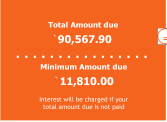
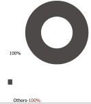
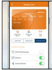
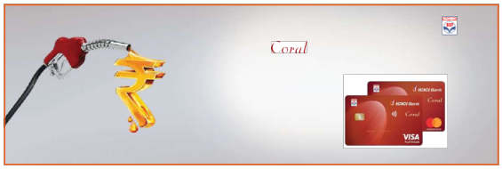

[PAGE_START_1]

CREDIT CARD STATEMENT

15112020_1

MR NAYANI SAGAR H.NO 4-31, HONNAJIPET DHARPALLY, NIZAMABAD

STATEMENT DATE June 22, 2024 ................................. PAYMENT DUE DATE July 22, 2024

SPINDS OVIREVIEW

Get 2.5% cashback and savings of 1% surcharge on fuel spends with ICICI Bank

OICICI Bank

Download the iMobile app to • View statement instantly

• Block/unblock ATM withdrawal, online transactions

& international transactions in a single click

SMS Mobile to 5676766 to get the download link or give a missed call on 9222299998 to get assistance on call.

TMC apply

All communications are being sent to your registered e-mail ID and mobile number

- • To update email ID and registered mailing address, visit www.icicibank.com > Login > Customer
Service > Service Requests > Credit Card > Request for address change or visit the nearest ICICI
Bank
branch
using

• To update mobile number, visit the nearest ATM or
Scan to Pay
Any Up
STATEMENT SUMMARY

<table><tr><td>Previous Balance</td><td>Purchases / Charges</td></tr><tr><td>`42,136.00</td><td>`1,18,303.90</td></tr></table>

<table><tr><td>Cash Advances</td><td>Payments / Credits</td></tr><tr><td>`0.00</td><td>`69,872.00</td></tr></table>

CREDIT SUMMARY

<table><tr><td colspan="2">Credit Limit (including cash)</td><td>Available Credit (including cash)</td><td>Cash Limit</td><td>Available Cash</td></tr><tr><td colspan="2">1,20,000.00</td><td>`2,885.50</td><td>`18,000.00</td><td>`2,885.50</td></tr><tr><td>Date</td><td>SerNo.</td><td>Transaction Details</td><td></td><td>Infl.a amount (in$^{*}$)</td></tr></table>

4375XXXXXXXX4006

<table><tr><td>02/07/2020</td><td>4598236064</td><td>UPI Payment Received</td><td>0</td><td>1,000.00 CR</td></tr><tr><td>03/07/2020</td><td>4598236633</td><td>UPI Payment Received</td><td>0</td><td>1,000.00 CR</td></tr><tr><td>03/07/2020</td><td>4598237294</td><td>UPI Payment Received</td><td>0</td><td>1,000.00 CR</td></tr><tr><td>04/07/2020</td><td>4598237841</td><td>UPI Payment Received</td><td>0</td><td>1,000.00 CR</td></tr><tr><td>06/07/2020</td><td>4598238320</td><td>UPI Payment Received</td><td>0</td><td>1,000.00 CR</td></tr><tr><td>08/07/2020</td><td>4598239140</td><td>UPI Payment Received</td><td>0</td><td>5,200.00 CR</td></tr><tr><td>08/07/2020</td><td>4598239443</td><td>UPI Payment Received</td><td>0</td><td>9.00 CR</td></tr><tr><td>09/07/2020</td><td>4598239958</td><td>UPI Payment Received</td><td>0</td><td>7.00 CR</td></tr><tr><td>10/07/2020</td><td>4598240518</td><td>UPI Payment Received</td><td>0</td><td>13.00 CR</td></tr><tr><td>10/07/2020</td><td>4598241537</td><td>UPI Payment Received</td><td>0</td><td>8.00 CR</td></tr><tr><td>10/07/2020</td><td>4598242275</td><td>UPI Payment Received</td><td>0</td><td>5.00 CR</td></tr><tr><td>10/07/2020</td><td>4598243250</td><td>UPI Payment Received</td><td>0</td><td>5.00 CR</td></tr></table>

<table><tr><td>15/07/2020</td><td>4611958898</td><td>REL RETAIL LTD-DIGITAL HYDERABAD IN</td><td>-450</td><td>22,500.00 CR</td></tr><tr><td>18/07/2020</td><td>4611964239</td><td>INSTANT EMI OFFUS CONVERSION</td><td>0</td><td>0.00 CR</td></tr></table>

Invoke No: 1574151100269497

CIN No. L65190GJ1994PLCD21012

Page 1 of 4

---

[PAGE_START_2]

<table><tr><td>22/06/2020</td><td>456660290</td><td>RELANCE DIGITAL HYDERABAD IN</td><td>530</td><td>26,499.00</td><td></td><td></td></tr><tr><td>29/06/2020</td><td>4586912601</td><td>UPI Payment Received</td><td>0</td><td>2,000.00 CR</td><td></td><td></td></tr><tr><td>28/06/2020</td><td>4588191045</td><td>AMAZON HTTP://WWW.AM IN</td><td>162</td><td>8,099.10</td><td></td><td></td></tr><tr><td>HPCL</td><td>Credit Card</td><td>13/07/2020</td><td>4607470614</td><td>REL RETAIL LTD-DIGITAL HYDERABAD IN</td><td>450</td><td>22,500.00</td></tr><tr><td></td><td>T&amp;amp;C only.</td><td></td><td></td><td></td><td></td><td></td></tr><tr><td></td><td></td><td>22/07/2020</td><td>4611964240</td><td>Interest Amount Amortization - &lt;1/3&gt;</td><td>0</td><td>243.56</td></tr></table>

<table><tr><td>Points Earned</td><td>Points Transferred to PAYBACK</td><td>PAYBACK Account Number</td></tr><tr><td>1762</td><td>1762</td><td>9401164815200001</td></tr></table>

### For detailed summary of Reward Points, please click here

3C1CI Bank Credit Card GST Number: 27AAAC11195H12K

HSN Code: 9971 Financial and Related Services

Statement period : October 16, 2020 to November 15,

2020 Place of supply: Maharashtra

State Code: 27

For ICICI Bank Limited| Amarjit S. Walia | Head - Consumer & Commercial

For any query, you may write to us on customer.care@icicibank.com or call us at 1860 120 7777.

## IMPORTANT MESSAGES

- • Safe Banking Tips -
• Our registered office address: ICICI Bank Tower, Near Chakli Circle, Old Padra Road, Vadodera, 390 007.
• Making only minimum payment every month can lead to repayment stretching over years with consequent interest
payment on outstanding balance.
• Please pay your Credit Card outstanding before the payment due date to avoid penal fees and interest charges.
• For any clarification or more information, you may contact us through the 'Get in Touch' option at www.icicibenk.com
• Mark-up fee and corresponding GST levied is included in the transaction amount displayed.
• For Visa/Mastercard Credit Cards: Fuel surcharge and corresponding Goods and Services Tax (GST) levied is included in
the transaction amount displayed.
• Payment through UPI is subject to the limits set by respective payment service providers.
Invoke No: 1574151100269497

CIN No. L65190GJ1994PLCD21012

Page 2 of 4

1/1

---

[PAGE_START_3]

<table><tr><td>Date</td><td>Ser No.</td><td>Transaction Details</td><td>Reward Points</td><td>Int.f. amount</td><td>Amount (in)</td></tr><tr><td>06/07/2020</td><td>4611964241</td><td>SGST-CI@9%</td><td>0</td><td></td><td>21.92</td></tr><tr><td>06/07/2020</td><td>4611964244</td><td>CGST-CI@9%</td><td>0</td><td></td><td>21.92</td></tr><tr><td>06/07/2020</td><td>4611964250</td><td>Principal Amount Amortization - &lt;1/3&gt;</td><td>0</td><td></td><td>7,419.40</td></tr><tr><td>10/07/2020</td><td>4622891364</td><td>Fipkart Internet Priv BANGALORE IN</td><td>140</td><td></td><td>6,999.00</td></tr><tr><td>13/17/2020</td><td>4630382456</td><td>RELANCE DIGITAL HYDERABAD IN</td><td>930</td><td></td><td>46,500.00</td></tr><tr><td colspan="6">437550000000004105</td></tr><tr><td>28/06/2020</td><td>4586187640</td><td>UPI Payment Received</td><td>0</td><td></td><td>5,000.00 OR</td></tr><tr><td>28/06/2020</td><td>4586187713</td><td>UPI Payment Received</td><td>0</td><td></td><td>13.00 OR</td></tr><tr><td>28/06/2020</td><td>4586616481</td><td>UPI Payment Received</td><td>0</td><td></td><td>5,001.00 OR</td></tr><tr><td>28/06/2020</td><td>4586616553</td><td>UPI Payment Received</td><td>0</td><td></td><td>14.00 OR</td></tr><tr><td>02/07/2020</td><td>4597454579</td><td>UPI Payment Received</td><td>0</td><td></td><td>1,000.00 OR</td></tr><tr><td>06/07/2020</td><td>4597455177</td><td>UPI Payment Received</td><td>0</td><td></td><td>1,000.00 OR</td></tr><tr><td>08/07/2020</td><td>4597455732</td><td>UPI Payment Received</td><td>0</td><td></td><td>1,000.00 OR</td></tr><tr><td>10/07/2020</td><td>4597456234</td><td>UPI Payment Received</td><td>0</td><td></td><td>1,000.00 OR</td></tr><tr><td>10/07/2020</td><td>459745656</td><td>UPI Payment Received</td><td>0</td><td></td><td>1,000.00 OR</td></tr><tr><td>10/07/2020</td><td>4597457112</td><td>UPI Payment Received</td><td>0</td><td></td><td>7.00 OR</td></tr><tr><td>10/07/2020</td><td>4597458004</td><td>UPI Payment Received</td><td>0</td><td></td><td>5,000.00 OR</td></tr><tr><td>13/07/2020</td><td>4597459574</td><td>UPI Payment Received</td><td>0</td><td></td><td>20.00 OR</td></tr><tr><td>14/07/2020</td><td>4597476373</td><td>UPI Payment Received</td><td>0</td><td></td><td>12.00 OR</td></tr><tr><td>14/07/2020</td><td>4597482360</td><td>UPI Payment Received</td><td>0</td><td></td><td>6.00 OR</td></tr><tr><td>16/07/2020</td><td>4597489209</td><td>UPI Payment Received</td><td>0</td><td></td><td>9.00 OR</td></tr><tr><td>16/07/2020</td><td>4597490199</td><td>UPI Payment Received</td><td>0</td><td></td><td>6.00 OR</td></tr><tr><td>16/07/2020</td><td>4597490909</td><td>UPI Payment Received</td><td>0</td><td></td><td>5,000.00 OR</td></tr><tr><td>16/07/2020</td><td>4597492046</td><td>UPI Payment Received</td><td>0</td><td></td><td>5,000.00 OR</td></tr><tr><td>16/07/2020</td><td>4597497936</td><td>UPI Payment Received</td><td>0</td><td></td><td>11.00 OR</td></tr><tr><td>18/07/2020</td><td>4597505459</td><td>UPI Payment Received</td><td>0</td><td></td><td>13.00 OR</td></tr><tr><td>18/07/2020</td><td>4598170209</td><td>UPI Payment Received</td><td>0</td><td></td><td>5,000.00 OR</td></tr><tr><td>18/07/2020</td><td>4600771444</td><td>UPI Payment Received</td><td>0</td><td></td><td>13.00 OR</td></tr></table>

" International Spends

## EMI / PERSONAL LOAN ON CREDIT CARDS

<table><tr><td>Transaction/LoanType</td><td>Creation Date</td><td>Finish Date</td><td>No. of Intailments</td><td>EMI/Loan Amount</td><td>Pending Installments</td><td>Outstanding Amount*</td><td>Monthly Installment Amount</td></tr><tr><td>Merchant EMI conversions</td><td>06/06/2024</td><td>06/08/2024</td><td>3</td><td>22,500.00</td><td>1</td><td>7,662.96</td><td>7,662.96</td></tr></table>

*For EMI Purchases and Loans within Credit Card limit, the credit limit of the credit card will be blocked by the amount which is equal to outstanding amount + Applicable Taxes and fees. *For loan on Credit Card-over the limit (PLCC OTL), the credit limit of the credit card will be blocked by the amount which is equal to billed EMI/EMIs + Applicable Taxes and fees.

1/1

Page 3 of 4

---

[PAGE_START_4]

MOST IMPORTANT TERMS AND CONDITIONS (MITC)

To get the complete version of Credit Cards – Most Important Terms and Conditions (MITC), please visit:

ICICI Bank Website>Products>Credit Cards>Terms and Conditions and FAQs>Most Important Terms and Conditions

Or visit the link: https://www.icicibank.com/managed-assets/docs/personal/cards/MITC_cc.pdf

## GREAT OFFERS ON YOUR CARD

Page 4 of 4

1/1

---

[PAGE_START_5]

## Up to ₹5000 off* on flight & holiday bookings

Offer Valid till December 31, 2020

For more details, visit www.icicibank.com/creditcardoffers

meth

## Flat 15% off on Annual and Half Yearly Membership

Offer till January 31, 2021

For more details, visit www.icicibank.com/creditcardoffers

A

TBC400

## Get up to 15% off at  Apollo Pharmacy store

Offer Valid till Mar 31, 2021

For more details, visit www.icicibank.com/creditcardoffers

TM□□

This is an authenticated intimation/statement. Customers are requested to immediately notify the Bank of any discrepancy in the statement.

Page 5 of 4

1/1

